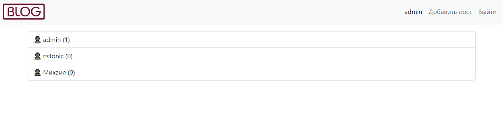

# Blog

Веб-сервис для размещения постов   



## Настройка

 - Для запуска сервиса понадобится python 3.11
 - Создайте виртуальное окружение `python3 -m venv venv`
 - Запустите его `source venv/bin/activate`
 - Установите зависимости `pip install -r requirements.txt`
 - Задайте переменные окружения (для локального окружения установите DEBUG = True):
```shell
  SECRET_KEY = '123456'
  DEBUG = True
  ALLOWED_HOSTS = 127.0.0.1,localhost
```
- Отмигрируйте БД `python3 manage.py migrate`
- Запустите веб сервер `python3 manage.py runserver`
- Для работы в админ-панели создайте суперпользователя `python3 manage.py createsuperuser`

## API

Сервис поддерживает работу через API:
  
| Endpoint                   | Method | Описание                       |
|----------------------------|--------|--------------------------------|
| /api/users                 | GET    | Получение списка пользователей |
| /api/users/<user_id>/posts | GET    | Получение постов пользователя  |
| /api/posts                 | POST   | Добавление нового поста        |
| /api/posts/<post_id>/      | DELETE | Удаление поста                 |
